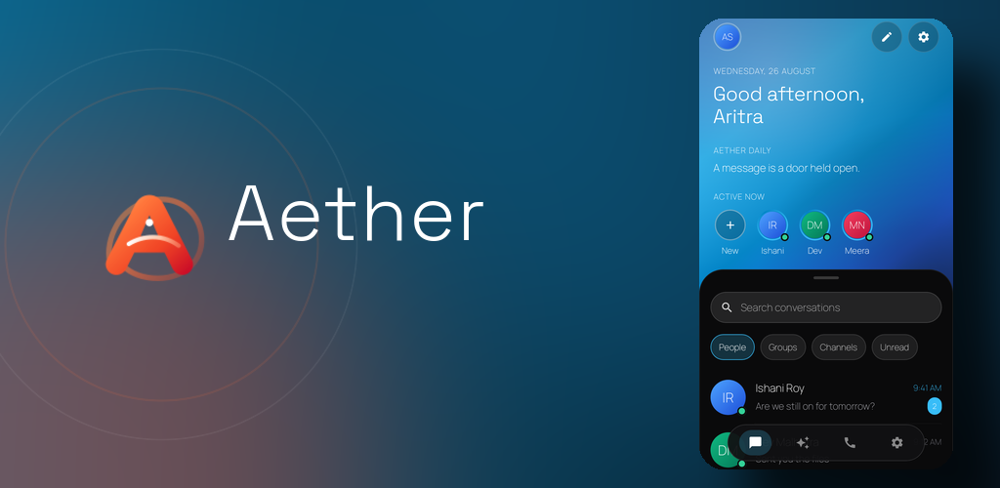

<p align="center">
  
</p>

<h1 align="center">Aether</h1>

<p align="center">
  <strong>A calmer Telegram experience, built around people.</strong>
</p>

<p align="center">
  Flagship product of <strong>Foresight Labs</strong> · Android · Powered by Telegram's official TDLib
</p>

<p align="center">
  
  
  
  
</p>

<p align="center">
  <a href="#screenshots">Screenshots</a> ·
  <a href="#features">Features</a> ·
  <a href="#project-status">Status</a> ·
  <a href="#build-from-source">Build</a> ·
  <a href="#architecture">Architecture</a>
</p>

<br>

<p align="center">
  
</p>

> [!NOTE]
> Aether is currently in **closed testing** and active development. The repository reflects a product that is still being refined, measured and validated on real Android devices.

## About

Aether is an independent Android client for Telegram focused on **personal conversation rather than feature density**.

Telegram provides the account, network, synchronization and protocol through TDLib. Aether builds its own interaction model, visual language, motion, privacy surfaces and navigation above it.

It is not intended to reproduce every Telegram surface. Groups, channels and forum topics remain reachable, but Aether is designed first around people and direct conversations.

## Screenshots

<p align="center">
  
  
</p>

<p align="center">
  
  
</p>

## Features

| Area | What Aether currently provides |
| --- | --- |
| **Messaging** | Direct chats, replies, quotes, edits, forwarding, selection and message actions |
| **Media** | Photos, video, documents, voice notes, video notes, stickers, emoji and GIFs |
| **Search** | Global search and in-conversation search |
| **Sharing** | Contacts, static location and venue sharing |
| **Stories** | Telegram stories presented through **Pulse** |
| **Privacy** | Local App Lock with passcode and supported Android biometrics |
| **Interface** | Dark atmospheric UI, living glass, equation-driven geometry and contextual motion |
| **Conversation UX** | Persistent rear **Curtain** for composer, attachments, forwarding and contextual actions |
| **Atmosphere** | Time-aware styling, optional approximate-location weather adaptation and dormant offline state |

### The Curtain

Aether treats Conversation as one continuous scene. Composer, attachments, forwarding, selection and other bottom interactions are states of a single persistent rear surface rather than unrelated sheets stacked over the UI.

> **The glass has no color. The environment behind the glass gives it color.**

That rule drives Aether's frosted surfaces: the material reacts to the scene behind it instead of carrying a decorative tint of its own.

## Project status

| Capability | Status |
| --- | --- |
| Personal messaging | ✅ Active |
| Media / documents | ✅ Active |
| Search | ✅ Active |
| Stories / Pulse | ✅ Active |
| App Lock / biometrics | ⏸ Held for this milestone (implementation and stored data preserved; hidden from UI) |
| Tablet adaptation | 🛠 In refinement |
| Performance / media latency | 🛠 In active optimization |
| Voice / video calling | 🛠 Enabled, in physical validation (real TDLib + ntgcalls transport; see [calling-native-stack.md](docs/architecture/calling-native-stack.md)) |
| Continuous live location | ⏸ Held |
| Device contact-book sync | ⏸ Held |

Aether does not expose unfinished functionality as though it were complete.

## Design language

Aether is dark by design.

| Role | Color |
| --- | --- |
| Base | `#090A0D` |
| Graphite | `#111318` |
| Raised graphite | `#181A21` |
| Lavender | `#747291` |
| Mist | `#A5A3B7` |

The interface favors spatial continuity, rounded mathematical forms, restrained motion and a quiet graphite/lavender atmosphere.

## Architecture

Aether is built with:

- **Kotlin**
- **Jetpack Compose**
- Telegram's official **TDLib Java/JNI bindings**
- Aether's own UI, state, navigation and interaction architecture

TDLib owns Telegram connectivity, synchronization, local database state, files and protocol communication. Aether owns the application experience above it.

Useful project references:

- [TDLIB.md](TDLIB.md) — pinned TDLib artifact details
- [Push notification architecture](docs/architecture/push-notifications.md)
- [Device validation notes](DEVICE_VALIDATION.md)

Release builds currently target **arm64-v8a** only.

## Build from source

<details>
<summary><strong>Show build requirements</strong></summary>

<br>

### Requirements

- Android Studio
- JDK 17 or newer to run Gradle/AGP itself (this is the toolchain Gradle runs on, separate from the app's own Java 11 bytecode target). JDK 25 is the deterministic daemon JDK this project pins via `gradle/gradle-daemon-jvm.properties` and is the recommended choice.
- Android SDK Platform 37
- Telegram API credentials from [my.telegram.org](https://my.telegram.org)
- Vendored TDLib Java/JNI artifacts described in [TDLIB.md](TDLIB.md)

Place local Telegram API values in the untracked `local.properties` file.

Never commit Telegram credentials, Firebase configuration containing project-specific values, or signing material.

For FCM-backed background notifications, provide the untracked `app/google-services.json` and configure the corresponding Firebase credentials for the Telegram application.

### Common checks

```bash
./gradlew testDebugUnitTest
./gradlew :app:assembleDebug
./gradlew :app:lintDebug :call-media:lintDebug
```

The root `./gradlew assembleDebug` (every module's own `assemble`, not just the
app) currently **fails**, not `:app`'s: `:call-media:bundleDebugAar` — the
`call-media` library module packaging *itself* as a standalone AAR, which
nothing consumes — is rejected by AGP because `call-media` depends on a local
`.aar` file (the vendored ntgcalls artifact under `call-media/libs/`), and AGP
refuses to bundle a local `.aar` dependency into another AAR. This is a
property of `call-media`'s own unused packaging output, not of the app: `:app`
never consumes `call-media` as a packaged AAR (only via `project(":call-media")`),
so `:app:assembleDebug` is unaffected and is the actual build/CI gate. The
project as a whole does not support root `assembleDebug`; only the scoped
per-module tasks above are the supported checks.

Release signing is configured outside the repository.

</details>

## Privacy and Telegram

Aether connects to Telegram through TDLib and does not alter Telegram's encryption model.

Foresight Labs does not operate Telegram infrastructure and does not run servers for Aether's Telegram traffic. Telegram account data, messages and media remain part of Telegram's system.

Permissions are requested contextually where practical. Weather adaptation uses approximate location only and falls back gracefully when location or network access is unavailable.

## Independence

Aether is an **independent, unofficial Telegram client**.

It is not affiliated with, sponsored by, or endorsed by Telegram. Telegram provides the platform and protocol Aether connects to; Foresight Labs does not own or represent Telegram technology.

## Product

**Aether**  
Flagship product of **Foresight Labs**  
Created by **Aritra Saha**  
Application ID: `com.foresightlabs.aether`

<p align="center">
  <br>
  <strong>Foresight Labs</strong><br>
  <sub>Focused software. Deliberate interaction.</sub>
</p>

<p align="center">
  <sub>© 2026 Aritra Saha / Foresight Labs. All rights reserved.</sub>
</p>
