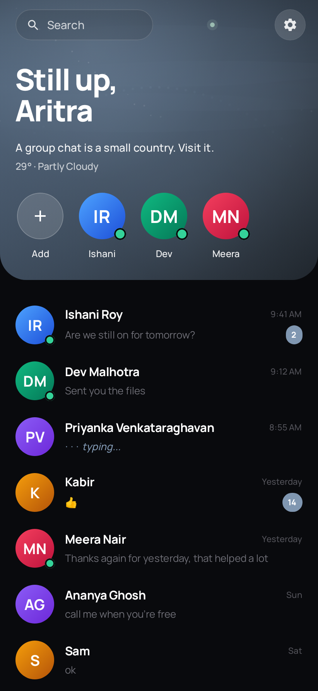
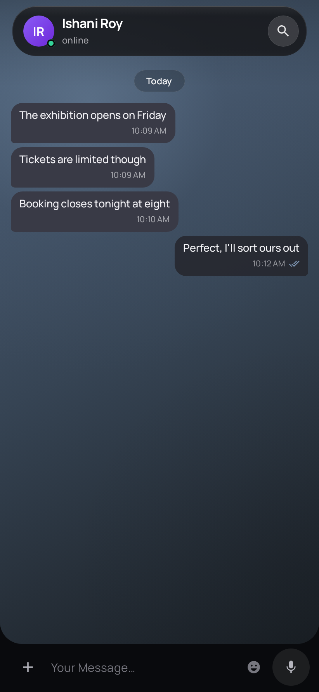
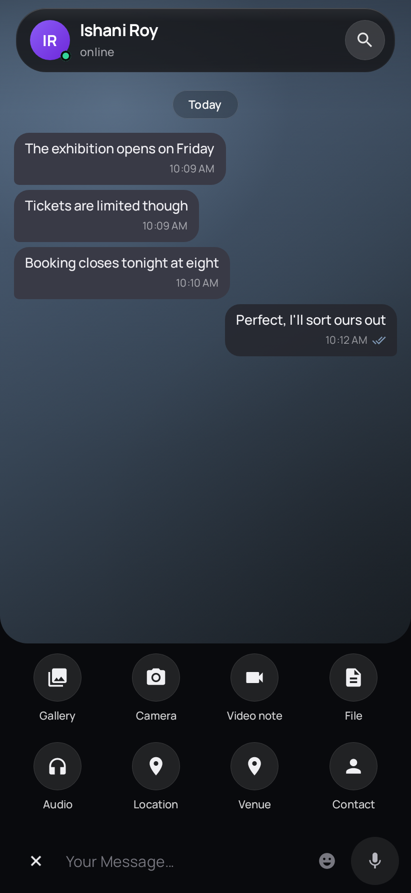
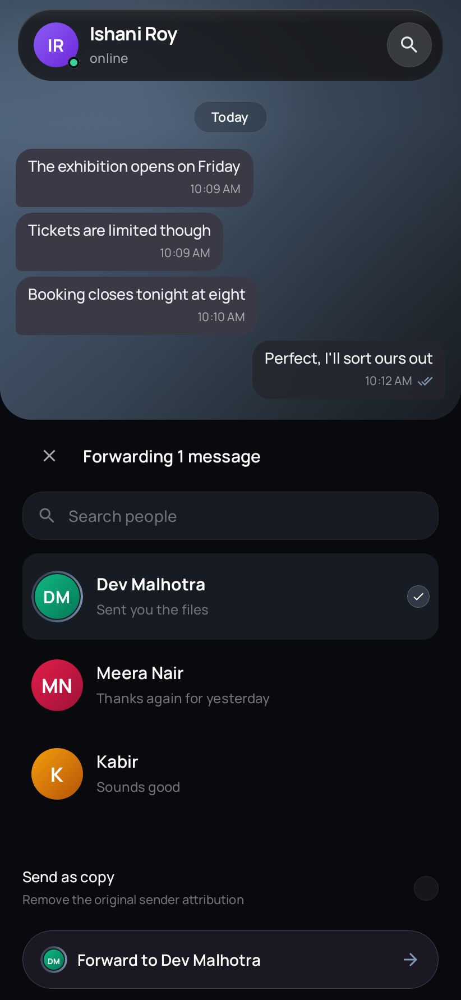

# Aether

**A quieter way to Telegram.**

Aether is an independent Android messenger from Foresight Labs, built on Telegram's official TDLib. It is not an attempt to reproduce every surface of Telegram. Aether explores what Telegram can feel like when people and personal conversations come first.

Currently distributed through closed testing.

<p>
  
  
</p>
<p>
  
  
</p>

## What Aether is

A personal messenger powered by Telegram.

Telegram supplies the account, the network and the protocol, through the official Telegram Database Library. Everything above that — the interaction model, the navigation, the visual language, the motion, the product priorities — is Aether's own.

## Why it exists

Telegram has become an extraordinarily capable communication platform. It spans private messaging, groups, large communities, channels, bots, forums, public content and discovery. Those capabilities are useful, and Aether is not arguing that they should not exist.

Aether starts from a smaller question:

**What if the conversation itself were the product?**

The answer this project is pursuing is a calmer, more deliberate environment built around direct communication, using Telegram's connectivity underneath.

## The ambition

Not to make Telegram look different — to build a distinct personal communication environment on top of it.

Interaction, navigation, motion and hierarchy are designed around conversation rather than feature density. Capabilities are added when they strengthen personal communication, not to close a gap on a comparison chart. Aether does not pursue feature parity for its own sake.

## What makes Aether different

**From Telegram.** Telegram is a broad communication platform, and a very good one. Aether deliberately chooses a narrower primary experience. The difference is scope and product philosophy, not a criticism of the platform it runs on.

**From other third-party clients.** Many third-party clients focus on extending, customizing or re-presenting the broader Telegram experience. Aether takes a more selective approach: it asks which parts of Telegram should become part of a focused personal messenger, and designs its own surface for the parts that stay.

## Principles

**People first.** Personal conversations remain the centre of the interface, rather than the inbox becoming a general information feed.

**Intentional scope.** A capability existing in Telegram does not automatically make it Aether UI.

**Continuous interaction.** Contextual actions emerge from the same conversation space instead of arriving as unrelated panels. Composing, attachments, forwarding and selection are states of one persistent surface — internally, the Curtain — not separate screens stacked over the conversation.

**Contextual permissions.** Access is requested when a feature actually needs it, not at first launch.

**Telegram underneath, Aether above.** TDLib provides connectivity; Aether owns the product experience.

**Calm by design.** Dark graphite surfaces, atmospheric light, rounded geometry and restrained motion, to keep visual noise low.

## Current scope

Aether is in active development. This section describes what exists today, not what is planned.

Available now: direct conversations with replies, quotes, edits, forwarding, selection and message actions; media, documents, voice and video notes; stickers, emoji and GIFs; static location and venue sharing; contacts; global and in-conversation search; Pulse, Aether's presentation of Telegram stories; per-chat appearance; an atmospheric interface that adapts to the time of day and, with permission, to local weather.

Your Telegram groups, channels and forum topics are reachable — Aether does not hide your chat list. They are simply not the surface the product is designed around, and the broader platform layers such as discovery and bot experiences are outside the current primary UI.

Held for a later milestone, behind flags, and not requesting their permissions in the meantime: voice and video calling, continuous live-location sharing, and device contact-book syncing. Telegram's own cloud contacts, and static location and venue sharing, remain fully functional.

## Privacy-conscious weather adaptation

Weather uses your approximate location only when needed. Aether does not continuously track or store your location. It requests coarse location only and never precise location, and it reads a last-known approximate fix rather than starting continuous updates.

Approximate coordinates are sent to Open-Meteo to look up current conditions; Aether does not claim that location never leaves the device. If location access is denied, no fix is available, or the weather service cannot be reached, the interface says so and falls back to time-only atmospheric styling.

## Security and privacy

Aether connects to Telegram through TDLib and does not change Telegram's encryption model in any way. Whatever protection a chat has, it has because Telegram provides it. Aether adds no encryption of its own and makes no claim beyond that.

Foresight Labs does not operate any Telegram infrastructure and does not run servers for Aether. Your account, messages and media live in Telegram's system exactly as they do with any other client.

Most permissions are requested at the point of use: the camera when you take a photo, the microphone when you record, coarse location when you share a place or enable weather adaptation. Notification permission is the exception — it is currently requested once after sign-in rather than at first notification. Capabilities held behind feature flags do not declare or request their permissions at all.

## Architecture

Kotlin and Jetpack Compose throughout, with the official TDLib Java/JNI bindings as the only Telegram dependency. The interface is built on Aether's own design system rather than stock Material surfaces. Details of the vendored TDLib artifacts are in [TDLIB.md](TDLIB.md).

## Build

- Android Studio with JDK 11 or newer
- Android SDK 36
- A Telegram API application registered at [my.telegram.org](https://my.telegram.org)
- The vendored TDLib Java/JNI artifacts described in [TDLIB.md](TDLIB.md)

Place local Telegram API values in the untracked `local.properties` file. Never commit credentials or signing material.

Common development checks:

```shell
./gradlew test
./gradlew assembleDebug
```

Rendering Home for visual inspection (writes PNGs to `app/build/reports/aether-screenshots/`):

```shell
./gradlew :app:testDebugUnitTest --tests '*HomeScreenshotTest*'
```

Release builds package `arm64-v8a` only; see [TDLIB.md](TDLIB.md).

Release signing is intentionally configured outside the repository.

## Independence

Aether is an independent, unofficial Telegram client. It is not affiliated with, sponsored by, or endorsed by Telegram. Telegram is the platform Aether connects to; Foresight Labs neither owns nor represents Telegram technology, and Telegram has no ownership of Aether.

## Identity and licensing

- Application name: Aether
- Application ID: `com.foresightlabs.aether`
- TDLib: Boost Software License 1.0
- Manrope and Space Grotesk fonts: SIL Open Font License 1.1

See the license texts bundled under `app/src/main/assets/licenses/` and the TDLib details in [TDLIB.md](TDLIB.md).

The floating-bar backdrop blur uses Haze 1.2.2, licensed under Apache License 2.0.

© 2026 Aritra Saha / Foresight Labs. All rights reserved.
